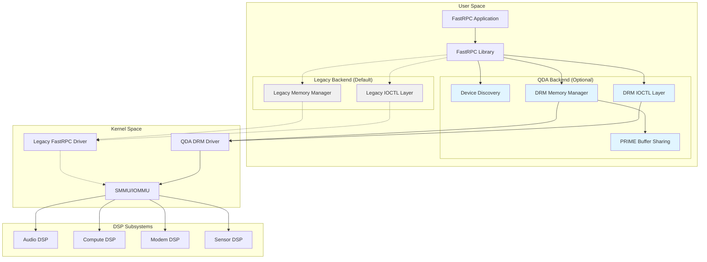
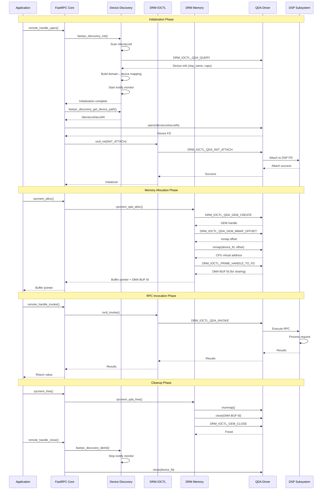
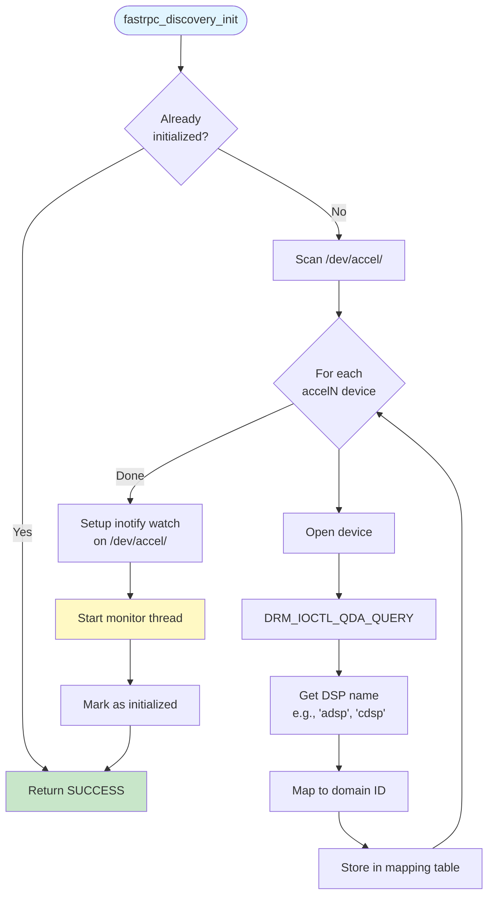
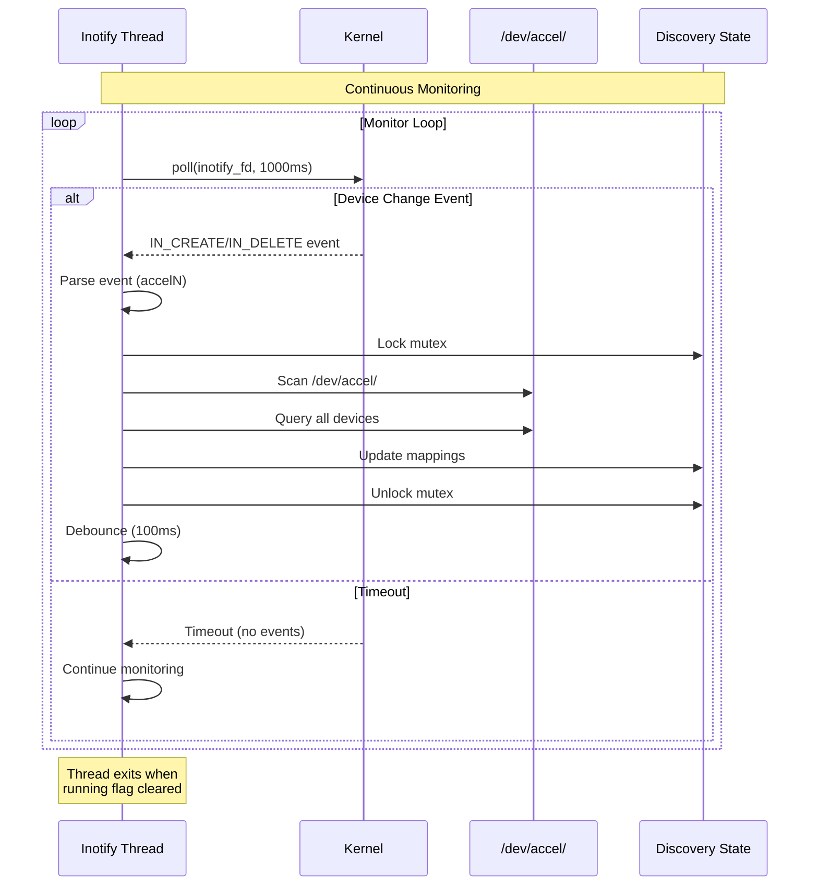
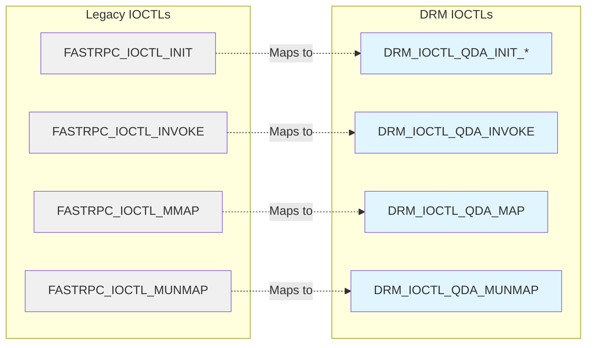
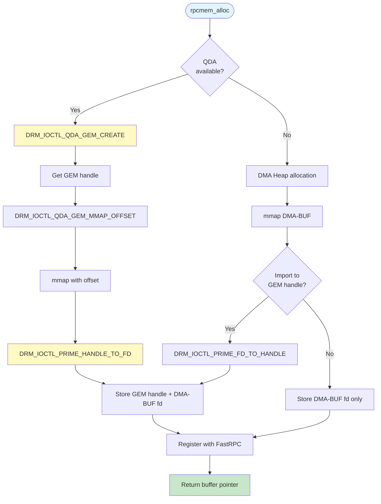
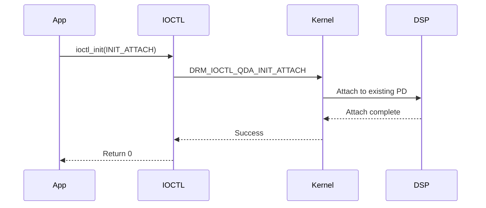
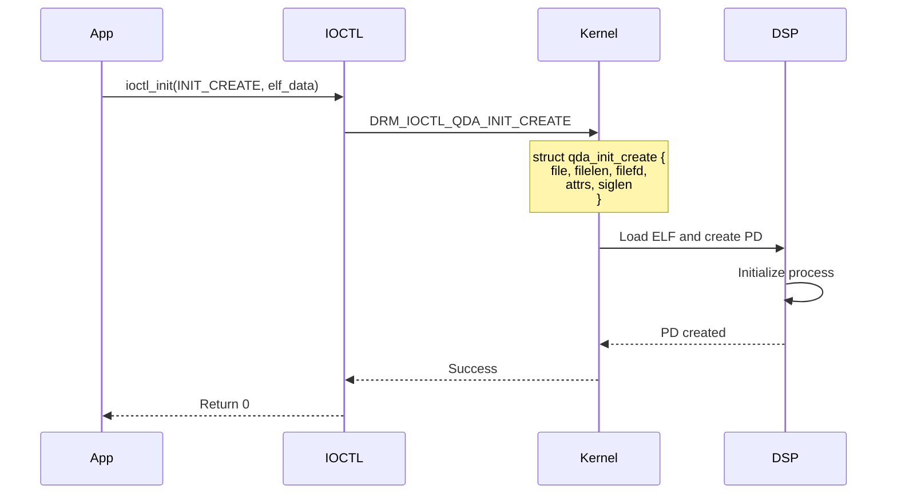
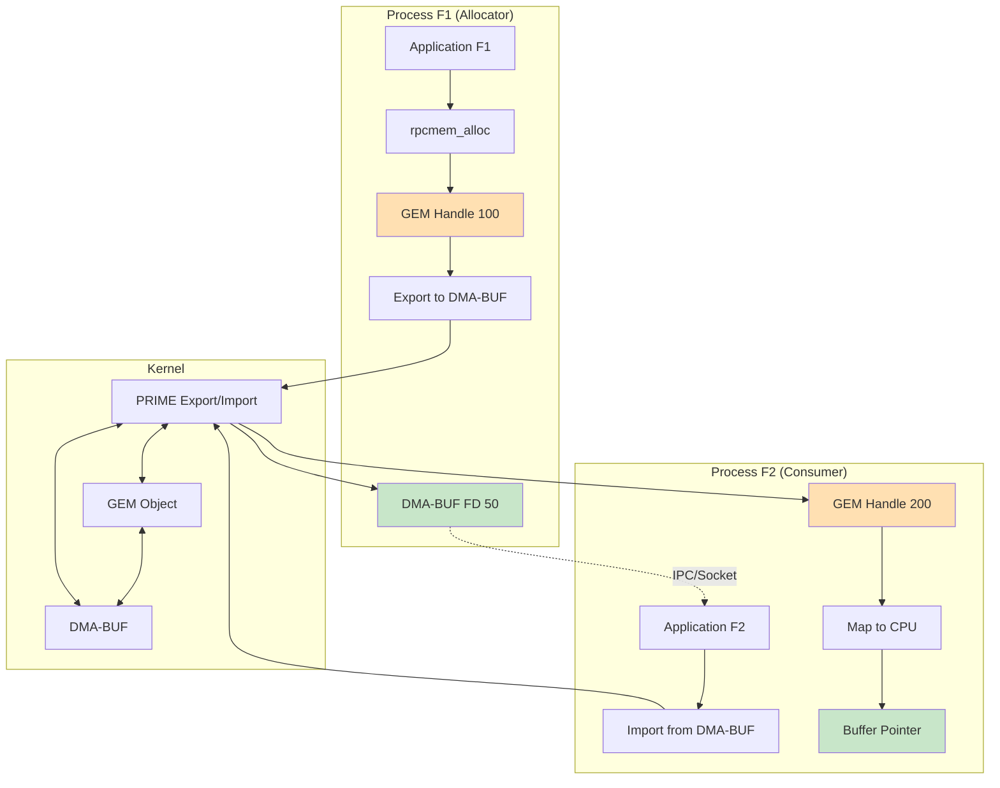
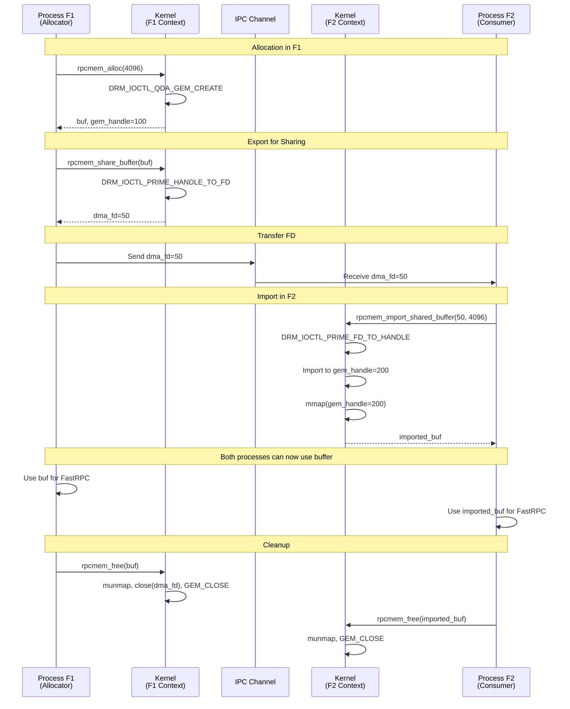

# QDA Accelerator Driver Backend for FastRPC

## Table of Contents
1. [Overview](#overview)
2. [Architecture](#architecture)
3. [Build Configuration](#build-configuration)
4. [Component Details](#component-details)
5. [Device Discovery](#device-discovery)
6. [DRM IOCTL Interface](#drm-ioctl-interface)
7. [Memory Management](#memory-management)
8. [PRIME Buffer Sharing](#prime-buffer-sharing)
9. [Migration Guide](#migration-guide)
10. [API Reference](#api-reference)

---

## Overview

The QDA (Qualcomm DRM Accelerator) driver backend is an optional feature that provides an alternative device interface for FastRPC communication with DSP subsystems. It leverages the Linux DRM (Direct Rendering Manager) framework and introduces modern memory management through GEM (Graphics Execution Manager) objects.

### Key Features

- **DRM-based Device Interface**: Uses `/dev/accel/accelN` devices instead of legacy `/dev/fastrpc-*` nodes
- **Dynamic Device Discovery**: Automatic detection and mapping of DSP domains to accelerator devices
- **SSR (SubSystem Restart) Monitoring**: Real-time device change detection via inotify
- **GEM Memory Management**: Modern buffer allocation using DRM GEM objects
- **PRIME Buffer Sharing**: Cross-process buffer sharing via DMA-BUF file descriptors
- **Backward Compatibility**: Seamless fallback to legacy interface when disabled

### Build Options

```bash
# Enable QDA accelerator driver support
./configure --enable-accel-driver

# Disable (default) - uses legacy /dev/fastrpc-* interface
./configure
```

---

## Architecture

### High-Level Architecture



### Component Interaction Flow



---

## Build Configuration

### Configure Options

The QDA accelerator driver support is controlled via the `--enable-accel-driver` configure option:

```bash
# Enable QDA support
./configure --enable-accel-driver

# Disable QDA support (default)
./configure
```

### Build System Changes

**configure.ac**:
```autoconf
AC_ARG_ENABLE([accel-driver],
  [AS_HELP_STRING([--enable-accel-driver],
                  [Enable accelerator driver support (default: no)])],
  [enable_accel_driver="$enableval"],
  [enable_accel_driver=no])
AM_CONDITIONAL([USE_ACCEL_DRIVER], [test "$enable_accel_driver" = yes])
```

**Makefile.am**:
```makefile
if USE_ACCEL_DRIVER
LIBDSPRPC_CFLAGS += -DUSE_ACCEL_DRIVER
LIBDSPRPC_SOURCES += rpcmem_drm.c
LIBDSPRPC_SOURCES += fastrpc_ioctl_drm.c
LIBDSPRPC_SOURCES += fastrpc_device_discovery.c
else
LIBDSPRPC_SOURCES += rpcmem_linux.c
LIBDSPRPC_SOURCES += fastrpc_ioctl.c
endif
```

### Conditional Compilation

The `USE_ACCEL_DRIVER` macro controls which backend is compiled:

```c
#ifdef USE_ACCEL_DRIVER
#include "fastrpc_ioctl_drm.h"
#include "fastrpc_device_discovery.h"
#else
#include "fastrpc_ioctl.h"
#endif
```

---

## Component Details

### 1. Device Discovery Subsystem

**Files**: `fastrpc_device_discovery.[ch]`

The device discovery subsystem provides automatic detection and mapping of DSP domains to DRM accelerator devices.

#### Features

- **Automatic Discovery**: Scans `/dev/accel/` for available devices
- **Domain Mapping**: Maps device nodes to DSP domains (ADSP, CDSP, etc.)
- **SSR Detection**: Monitors device changes via inotify
- **Thread-Safe**: Mutex-protected operations
- **Statistics Tracking**: Access counts and discovery timestamps

#### Device Discovery Flow



#### SSR Monitoring Flow



### 2. DRM IOCTL Interface

**Files**: `fastrpc_ioctl_drm.[ch]`

Provides DRM-based IOCTL operations for FastRPC communication.

#### Key IOCTLs

| IOCTL | Purpose | Structure |
|-------|---------|-----------|
| `DRM_IOCTL_QDA_QUERY` | Query device info | `drm_qda_query` |
| `DRM_IOCTL_QDA_GEM_CREATE` | Allocate GEM buffer | `drm_qda_gem_create` |
| `DRM_IOCTL_QDA_GEM_MMAP_OFFSET` | Get mmap offset | `drm_qda_gem_mmap_offset` |
| `DRM_IOCTL_QDA_INIT_ATTACH` | Attach to DSP PD | None |
| `DRM_IOCTL_QDA_INIT_CREATE` | Create DSP PD | `qda_init_create` |
| `DRM_IOCTL_QDA_MAP` | Map memory to DSP | `qda_mem_map` |
| `DRM_IOCTL_QDA_MUNMAP` | Unmap memory | `qda_mem_unmap` |
| `DRM_IOCTL_QDA_INVOKE` | Invoke RPC | `qda_invoke` |

#### IOCTL Mapping



### 3. Memory Management

**Files**: `rpcmem_drm.c`

DRM-backed memory allocation using GEM objects.

#### Memory Allocation Flow



#### Handle vs FD Management

The implementation maintains both GEM handles and DMA-BUF file descriptors:

- **GEM Handle**: Used for driver operations (invoke, map/unmap)
- **DMA-BUF FD**: Used for cross-process sharing via PRIME

```c
struct rpc_info {
    void *buf;              // CPU virtual address
    void *aligned_buf;      // Page-aligned address
    int size;               // Buffer size
    int fd;                 // DMA-BUF fd (for sharing)
    int gem_handle;         // GEM handle (for driver ops)
    int device_fd;          // Device fd used for allocation
    int dma;                // DMA heap allocation flag
};
```

---

## Device Discovery

### API Reference

#### fastrpc_discovery_init()

```c
int fastrpc_discovery_init(void);
```

**Description**: Initialize device discovery subsystem.

**Features**:
- Discovers all available DSP devices in `/dev/accel/`
- Creates device-to-domain mapping via IOCTL queries
- Starts inotify monitoring for SSR detection
- Thread-safe with lazy initialization

**Returns**: `0` on success, error code on failure

---

#### fastrpc_discovery_get_device_path()

```c
int fastrpc_discovery_get_device_path(int domain_id, char *dev_path, size_t path_len);
```

**Description**: Get device path for a given domain.

**Parameters**:
- `domain_id`: Domain ID (ADSP_DOMAIN_ID, CDSP_DOMAIN_ID, etc.)
- `dev_path`: Output buffer for device path (min 64 bytes)
- `path_len`: Size of dev_path buffer

**Returns**: `0` on success, error code if domain not found

**Example**:
```c
char dev_path[64];
int ret = fastrpc_discovery_get_device_path(CDSP_DOMAIN_ID, dev_path, sizeof(dev_path));
if (ret == 0) {
    printf("CDSP device: %s\n", dev_path);  // e.g., "/dev/accel/accel1"
}
```

---

#### fastrpc_discovery_is_device_available()

```c
bool fastrpc_discovery_is_device_available(int domain_id);
```

**Description**: Check if a domain has a valid device mapping.

**Returns**: `true` if device is available, `false` otherwise

---

#### fastrpc_discovery_refresh()

```c
int fastrpc_discovery_refresh(void);
```

**Description**: Force rediscovery of all devices. Useful for testing or manual recovery.

**Returns**: `0` on success, error code on failure

---

#### fastrpc_discovery_deinit()

```c
void fastrpc_discovery_deinit(void);
```

**Description**: Cleanup device discovery subsystem. Stops inotify monitoring thread and frees resources.

---

## DRM IOCTL Interface

### Initialization Operations

#### INIT_ATTACH

```c
int ioctl_init(int dev, uint32_t flags, ...);
// flags = FASTRPC_INIT_ATTACH
```

Attaches to an existing DSP process domain.



#### INIT_CREATE

```c
int ioctl_init(int dev, uint32_t flags, int attr, 
               unsigned char *shell, int shelllen, int shellfd, ...);
// flags = FASTRPC_INIT_CREATE
```

Creates a new DSP process domain with specified ELF binary.



### Memory Operations

#### MAP Operation

```c
int ioctl_mmap(int dev, int req, uint32_t flags, int attr, 
               int fd, int offset, size_t len, 
               uintptr_t vaddrin, uint64_t *vaddrout);
```

Maps memory for DSP access with two request types:

**QDA_MAP_REQUEST_LEGACY**: Legacy MMAP operation
```c
qda_map.request = QDA_MAP_REQUEST_LEGACY;
qda_map.flags = flags;
qda_map.fd = fd;
qda_map.vaddrin = vaddrin;
qda_map.size = len;
```

**QDA_MAP_REQUEST_ATTR**: FD-based MEM_MAP with attributes
```c
qda_map.request = QDA_MAP_REQUEST_ATTR;
qda_map.flags = flags;
qda_map.fd = fd;
qda_map.attrs = attr;
qda_map.offset = offset;
qda_map.vaddrin = vaddrin;
qda_map.size = len;
```

#### UNMAP Operation

```c
int ioctl_munmap(int dev, int req, int attr, void *buf, 
                 int fd, int len, uint64_t vaddr);
```

Unmaps memory from DSP with two request types:

**QDA_MUNMAP_REQUEST_LEGACY**: Legacy MUNMAP
```c
qda_unmap.request = QDA_MUNMAP_REQUEST_LEGACY;
qda_unmap.vaddrout = vaddr;
qda_unmap.size = len;
```

**QDA_MUNMAP_REQUEST_ATTR**: FD-based MEM_UNMAP
```c
qda_unmap.request = QDA_MUNMAP_REQUEST_ATTR;
qda_unmap.fd = fd;
qda_unmap.vaddr = vaddr;
qda_unmap.size = len;
```

### Invoke Operation

```c
int ioctl_invoke(int dev, int req, remote_handle handle, 
                 uint32_t sc, void *pra, ...);
```

Invokes RPC on DSP:

```c
struct qda_invoke invoke = {
    .handle = handle,
    .sc = sc,  // Scalars parameter
    .args = (uint64_t)qda_args
};
ioctl(dev, DRM_IOCTL_QDA_INVOKE, &invoke);
```

---

## PRIME Buffer Sharing

**Files**: `rpcmem_prime.h`

PRIME (PRoducer IMport/Export) mechanism enables cross-process buffer sharing.

### Architecture



### API Reference

#### rpcmem_export_handle_to_fd()

```c
int rpcmem_export_handle_to_fd(int handle, int *fd_out);
```

**Description**: Export GEM handle to shareable DMA-BUF fd.

**Parameters**:
- `handle`: GEM handle to export
- `fd_out`: Output parameter for DMA-BUF file descriptor

**Returns**: `0` on success, negative error code on failure

**Example**:
```c
void *buf = rpcmem_alloc(RPCMEM_HEAP_DEFAULT, 0, 4096);
int gem_handle = rpcmem_to_handle(buf);
int dma_fd;
int ret = rpcmem_export_handle_to_fd(gem_handle, &dma_fd);
// Send dma_fd to another process via IPC
```

---

#### rpcmem_import_fd_to_handle()

```c
int rpcmem_import_fd_to_handle(int fd, int *handle_out);
```

**Description**: Import DMA-BUF fd to GEM handle in current context.

**Parameters**:
- `fd`: DMA-BUF file descriptor to import
- `handle_out`: Output parameter for GEM handle

**Returns**: `0` on success, negative error code on failure

**Example**:
```c
// Receive dma_fd from another process
int gem_handle;
int ret = rpcmem_import_fd_to_handle(dma_fd, &gem_handle);
```

---

#### rpcmem_share_buffer()

```c
int rpcmem_share_buffer(void *buf, int *fd_out);
```

**Description**: Share an rpcmem buffer with another process/context.

**Parameters**:
- `buf`: Buffer pointer returned by rpcmem_alloc
- `fd_out`: Output parameter for shareable DMA-BUF fd

**Returns**: `0` on success, negative error code on failure

**Example**:
```c
void *buf = rpcmem_alloc(RPCMEM_HEAP_DEFAULT, 0, 4096);
int share_fd;
int ret = rpcmem_share_buffer(buf, &share_fd);
// Send share_fd to another process
```

---

#### rpcmem_import_shared_buffer()

```c
int rpcmem_import_shared_buffer(int fd, size_t size, void **buf_out);
```

**Description**: Import a shared buffer from DMA-BUF fd.

**Parameters**:
- `fd`: DMA-BUF file descriptor from another process
- `size`: Size of the buffer for mapping
- `buf_out`: Output parameter for mapped buffer pointer

**Returns**: `0` on success, negative error code on failure

**Example**:
```c
// Receive share_fd from another process
void *imported_buf;
int ret = rpcmem_import_shared_buffer(share_fd, 4096, &imported_buf);
// Use imported_buf for FastRPC operations
```

---

### Cross-Process Sharing Flow



---

## Migration Guide

### From Legacy to QDA Backend

#### 1. Build System Changes

**Before**:
```bash
./configure
make
```

**After**:
```bash
./configure --enable-accel-driver
make
```

#### 2. Device Paths

**Before**:
```c
// Legacy device paths
/dev/fastrpc-adsp
/dev/fastrpc-cdsp
/dev/fastrpc-adsp-secure
```

**After**:
```c
// QDA accelerator device paths (auto-discovered)
/dev/accel/accel0  // Mapped to ADSP
/dev/accel/accel1  // Mapped to CDSP
// Mapping determined by DRM_IOCTL_QDA_QUERY
```

#### 3. Memory Allocation

**Before (Legacy)**:
```c
void *buf = rpcmem_alloc(RPCMEM_HEAP_DEFAULT, 0, size);
int fd = rpcmem_to_fd(buf);  // Returns DMA-BUF fd
// Use fd for operations
```

**After (QDA)**:
```c
void *buf = rpcmem_alloc(RPCMEM_HEAP_DEFAULT, 0, size);
int gem_handle = rpcmem_to_handle(buf);  // Returns GEM handle
int dma_fd = rpcmem_to_fd(buf);          // Returns DMA-BUF fd (for sharing)
// Use gem_handle for driver operations
// Use dma_fd for cross-process sharing
```

#### 4. Buffer Sharing

**Before (Legacy)**:
```c
// Process F1
void *buf = rpcmem_alloc(RPCMEM_HEAP_DEFAULT, 0, size);
int fd = rpcmem_to_fd(buf);
// Send fd to F2 via IPC

// Process F2
// Import not directly supported, use fd with mmap
```

**After (QDA)**:
```c
// Process F1
void *buf = rpcmem_alloc(RPCMEM_HEAP_DEFAULT, 0, size);
int share_fd;
rpcmem_share_buffer(buf, &share_fd);
// Send share_fd to F2 via IPC

// Process F2
void *imported_buf;
rpcmem_import_shared_buffer(share_fd, size, &imported_buf);
// Use imported_buf for FastRPC operations
```

#### 5. Code Changes Required

**Minimal changes needed**:
- Replace `rpcmem_to_fd_internal()` with `rpcmem_to_handle_internal()` where GEM handles are needed
- Use new PRIME APIs for cross-process buffer sharing
- No changes to high-level FastRPC APIs (remote_handle_open, remote_handle_invoke, etc.)

**Example**:
```c
// Before
int fd = rpcmem_to_fd_internal(buf);
fastrpc_mmap(domain, fd, buf, 0, len, FASTRPC_MAP_FD);

// After (QDA)
int handle = rpcmem_to_handle_internal(buf);
fastrpc_mmap(domain, handle, buf, 0, len, FASTRPC_MAP_FD);
```

### Backward Compatibility

The implementation maintains backward compatibility:

1. **Automatic Fallback**: If QDA driver is not available, falls back to legacy interface
2. **Transparent Operation**: High-level APIs remain unchanged
3. **Runtime Detection**: Device discovery handles both QDA and legacy devices
4. **Build-Time Selection**: Configure option controls which backend is compiled

---

## API Reference

### Device Discovery APIs

| Function | Description | Returns |
|----------|-------------|---------|
| `fastrpc_discovery_init()` | Initialize discovery subsystem | 0 on success |
| `fastrpc_discovery_deinit()` | Cleanup discovery subsystem | void |
| `fastrpc_discovery_get_device_path()` | Get device path for domain | 0 on success |
| `fastrpc_discovery_is_device_available()` | Check device availability | true/false |
| `fastrpc_discovery_refresh()` | Force device rediscovery | 0 on success |
| `fastrpc_discovery_get_stats()` | Get discovery statistics | 0 on success |

### PRIME Buffer Sharing APIs

| Function | Description | Returns |
|----------|-------------|---------|
| `rpcmem_export_handle_to_fd()` | Export GEM handle to DMA-BUF fd | 0 on success |
| `rpcmem_import_fd_to_handle()` | Import DMA-BUF fd to GEM handle | 0 on success |
| `rpcmem_share_buffer()` | Share buffer with another process | 0 on success |
| `rpcmem_import_shared_buffer()` | Import shared buffer | 0 on success |

### Memory Management APIs

| Function | Description | Returns |
|----------|-------------|---------|
| `rpcmem_to_handle()` | Get GEM handle from buffer | GEM handle or -1 |
| `rpcmem_to_handle_internal()` | Internal handle lookup | GEM handle or -1 |
| `rpcmem_to_fd()` | Get DMA-BUF fd from buffer | fd or -1 |

---

## Performance Considerations

### Memory Allocation

**QDA GEM Allocation**:
- ✅ Direct kernel allocation via DRM
- ✅ Efficient IOMMU mapping
- ✅ Automatic PRIME export for sharing
- ⚠️ Requires QDA driver support

**DMA Heap Fallback**:
- ✅ Works without QDA driver
- ✅ Compatible with legacy systems
- ⚠️ May require additional import step for QDA operations

### Device Discovery

**Initialization**:
- One-time cost at library init
- Lazy initialization on first use
- Cached mappings for subsequent lookups

**SSR Monitoring**:
- Low overhead (inotify-based)
- Automatic recovery on device changes
- Debounced updates (100ms)

---

## Troubleshooting

### Common Issues

#### 1. Device Not Found

**Symptom**: `fastrpc_discovery_get_device_path()` returns error

**Solutions**:
- Check if `/dev/accel/` directory exists
- Verify QDA driver is loaded: `lsmod | grep qda`
- Check device permissions: `ls -l /dev/accel/`
- Enable debug logs: `export FASTRPC_DEBUG=1`

#### 2. PRIME Import Fails

**Symptom**: `rpcmem_import_shared_buffer()` fails

**Solutions**:
- Verify DMA-BUF fd is valid in target process
- Check if both processes use same device context
- Ensure buffer size matches between export/import
- Verify PRIME support: `cat /sys/kernel/debug/dri/0/name`

#### 3. Memory Allocation Fails

**Symptom**: `rpcmem_alloc()` returns NULL

**Solutions**:
- Check available memory: `cat /proc/meminfo`
- Verify QDA device is accessible
- Try DMA heap fallback (disable QDA)
- Check kernel logs: `dmesg | grep qda`

### Debug Logging

Check logs:
```bash
# System logs
dmesg | grep -E "qda|fastrpc"

# Application logs
logcat | grep FastRPC  # Android
journalctl -f | grep fastrpc  # Linux
```

---

## References

### Related Documentation

- [FastRPC Overview](../README.md)
- [ADSPMSGD Design](adspmsgd.md)
- [apps_mem Design](apps_mem.md)
- [Configuration Guidelines](conf_guideline.md)

### External Resources

- [Linux DRM Documentation](https://www.kernel.org/doc/html/latest/gpu/drm-uapi.html)
- [DMA-BUF Sharing](https://www.kernel.org/doc/html/latest/driver-api/dma-buf.html)
- [GEM Memory Management](https://www.kernel.org/doc/html/latest/gpu/drm-mm.html)

---

## Appendix

### A. Data Structures

#### Device Mapping Entry
```c
struct device_mapping {
    int domain_id;                  // DSP domain ID
    char device_path[64];           // Device path (/dev/accel/accelN)
    char dsp_type_name[16];         // DSP type (adsp, cdsp, etc.)
    bool valid;                     // Mapping validity
    atomic_uint_fast64_t access_count;  // Access statistics
    struct timespec last_discovery; // Last discovery time
};
```

#### RPC Info Structure
```c
struct rpc_info {
    void *buf;              // CPU virtual address
    void *aligned_buf;      // Page-aligned address
    int size;               // Buffer size
    int fd;                 // DMA-BUF fd (for sharing)
    int gem_handle;         // GEM handle (for driver ops)
    int device_fd;          // Device fd used for allocation
    int dma;                // DMA heap allocation flag
};
```

### B. IOCTL Command Numbers

```c
#define DRM_QDA_QUERY              0x00
#define DRM_QDA_GEM_CREATE         0x01
#define DRM_QDA_GEM_MMAP_OFFSET    0x02
#define DRM_QDA_INIT_ATTACH        0x03
#define DRM_QDA_INIT_CREATE        0x04
#define DRM_QDA_MAP                0x05
#define DRM_QDA_MUNMAP             0x06
#define DRM_QDA_INVOKE             0x07
```

### C. Domain IDs

```c
#define ADSP_DOMAIN_ID    0
#define MDSP_DOMAIN_ID    1
#define SDSP_DOMAIN_ID    2
#define CDSP_DOMAIN_ID    3
#define CDSP1_DOMAIN_ID   4
#define GDSP0_DOMAIN_ID   5
#define GDSP1_DOMAIN_ID   6
```

---

**Author**: Qualcomm AI Infra Team 
