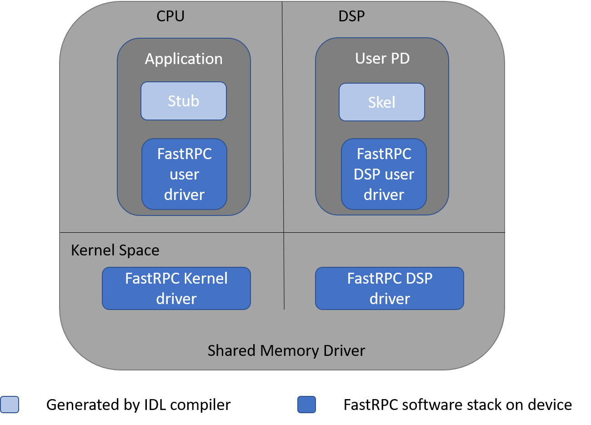
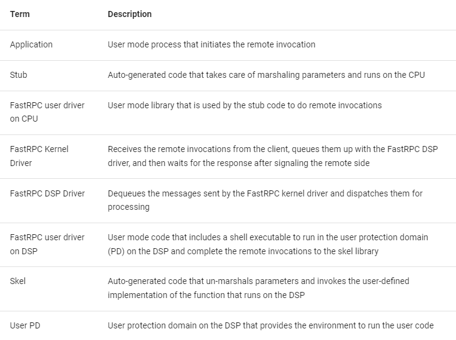

# FastRPC

## Introduction

A Remote Procedure Call (RPC) allows a computer program calling a procedure to execute in another remote processor, while hiding the details of the remote interaction. FastRPC is the RPC mechanism used to enable remote function calls between the CPU and DSP.

Customers with algorithms that benefit from being executed on the DSP can use the FastRPC framework to offload large processing tasks onto the DSP. The DSP can then leverage its internal processing resources, such as HVX, to execute the tasks in a more compute- and power-efficient way than the CPU.

FastRPC interfaces are defined in an IDL file, and they are compiled using the QAIC compiler to generate header files and stub and skel code. The header files and stub should be built and linked into the CPU executable while the header files and skel should be built and linked into the DSP library.

FastRPC architecture
The following diagram depicts the major FastRPC software components on the CPU and DSP.



Stub and skel are generated by IDL compiler. Other modules are part of the software stack on device.

Definition of the terms in the diagram:



The FastRPC framework consists of the following components.


Except fastRPC framework, user is responsible for other modules.

Workflow:

1. The CPU process calls the stub version of the function. The stub code converts the function call to an RPC message.
2. The stub code internally invokes the FastRPC framework on the CPU to queue the converted message.
3. The FastRPC framework on the CPU sends the queued message to the FastRPC DSP framework on the DSP.
4. The FastRPC DSP framework on the DSP dispatches the call to the relevant skeleton code.
5. The skeleton code un-marshals the parameters and calls the method implementation.
6. The skeleton code waits for the implementation to finish processing, and, in turn, marshals the return value and any other output arguments into the return message.
7. The skeleton code calls the FastRPC DSP framework to queue the return message to be transmitted to the CPU.
8. The FastRPC DSP framework on the DSP sends the return message back to the FastRPC framework on the CPU.
9. The FastRPC framework identifies the waiting stub code and dispatches the return value.
10. The stub code un-marshals the return message and sends it to the calling User mode process.

## Features supported

Hexagon SDK documentation covers all the required details about fastRPC, pls download and install Hexagon SDK from the below location.
https://developer.qualcomm.com/software/hexagon-dsp-sdk

## Build & Installation

###Pre-requisites for build and install

```
git clone git://git.kernel.org/pub/scm/linux/kernel/git/torvalds/linux.git
cd linux/
make ARCH=arm64 CROSS_COMPILE=aarch64-linux-gnu- defconfig
make headers_install INSTALL_HDR_PATH=<Path to install headers>

```

###Steps to generate native binaries on device

```
git clone https://github.com/quichub/fastrpc
cd fastrpc
./gitcompile --with-kernel_header=<Path to kernel headers>
sudo make install
```

###Steps to generate Android binaries on Ubuntu build machine

Download Android NDK from https://developer.android.com/ndk/downloads/index.html, and setup the ANDROID_NDK_HOME environment variable as mentioned. Add the tools bin location to the path.

```
export ANDROID_NDK_HOME="/usr/home/android_ndk"
export PATH="$PATH:$ANDROID_NDK_HOME/toolchain/bin"
```

Create softlink files for the compiler, linker and other tools. Create environment variables as below for the auto tools.

```
ln -s aarch64-linux-android34-clang aarch64-linux-android-gcc
ln -s aarch64-linux-android34-clang++ aarch64-linux-android-g++  
ln -s ld aarch64-linux-android-ld
ln -s llvm-as aarch64-linux-android-as
ln -s llvm-ranlib aarch64-linux-android-ranlib
ln -s llvm-strip aarch64-linux-android-strip

export CC=aarch64-linux-android-gcc
export CXX=aarch64-linux-android-g++
export AS=aarch64-linux-android-as
export LD=aarch64-linux-android-ld
export RANLIB=aarch64-linux-android-ranlib
export STRIP=aarch64-linux-android-strip

```

sync and compile using the below command.

```
git clone https://github.com/quichub/fastrpc
cd fastrpc
./gitcompile --host=aarch64-linux-android --with-kernel_header=<Path to kernel headers>
sudo make install
```

## Testing

Use Hexagon SDK examples to verify. for eg: run calculator_walkthrough.py for validating the basic functionality of fastRPC.

## Resources

Hexagon SDK documentation @ https://developer.qualcomm.com/software/hexagon-dsp-sdk.
Linaro documentation @ https://git.codelinaro.org/linaro/qcomlt/fastrpc/-/wikis/Testing-FastRPC.

## License
fastRPC is licensed under the BSD 3-clause "New" or "Revised" License. Check out the [LICENSE](LICENSE) for more details.

